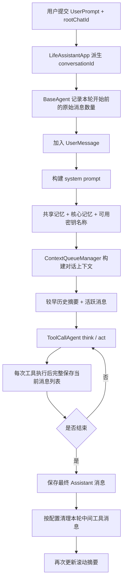

# 对话记忆与上下文管理

本文说明当前项目中对话消息、上下文窗口、核心记忆、共享记忆和归档记忆的实际实现，以及一次 Agent 运行期间这些数据如何读写和清理。

## 1. 记忆分层

| 层级 | 存储 | Key / 表 | 作用域 | 是否默认进入 prompt |
| --- | --- | --- | --- | --- |
| 对话记忆 | Redis List | `chat:memory:{conversationId}` | 单个 Agent 的单次对话 | 活跃窗口部分进入 |
| 滚动摘要 | Redis String | `life:memory:queue:summary:{conversationId}` | 单个 Agent 的单次对话 | 是 |
| 压缩游标 | Redis String | `life:memory:queue:compressed-count:{conversationId}` | 单个 Agent 的单次对话 | 否 |
| 核心记忆 | Redis Hash | `life:memory:core:{agentId}` | 单个 Agent 的所有对话 | 是 |
| 共享记忆 | Redis Hash | `life:memory:shared:{rootChatId}` | 同一 root 对话内所有 Agent | 是 |
| 归档记忆 | PGVector | `public.life_archival_memory` | 写入时使用的 conversationId | 按需检索 |
| 文档知识 | PGVector | `public.vector_store` | 全局 | 由 RAG Advisor 检索 |

这些层解决的问题不同：

- 对话记忆保留原始交互和工具过程，便于继续对话、检索和调试。
- 滚动摘要控制真正进入模型的历史长度。
- 核心记忆保存 Agent 跨对话复用的稳定信息。
- 共享记忆为 Supervisor 与 Worker 提供同一会话的公共工作区。
- 归档记忆保存不需要每轮常驻、但未来可能再次检索的材料。

## 2. chatId 与 conversationId

前端创建对话时生成 UUID，并在同一对话的每次请求中复用：

```text
rootChatId = 4a7e...-uuid
```

`LifeAssistantApp` 根据当前 Agent 派生内部 conversationId：

```text
life-coordinator:{rootChatId}
life-planner:{rootChatId}
life-researcher:{rootChatId}
life-manus:{rootChatId}
```

作用域规则：

```text
对话记忆、滚动摘要、归档记忆 -> conversationId
核心记忆                     -> agentId
共享记忆                     -> rootChatId
```

因此，同一 root 对话中的不同 Agent 拥有独立对话历史，但能读取同一份共享记忆。一个 Agent 在不同 root 对话中会复用自己的核心记忆。

当前没有 userId 维度。多用户部署前，核心记忆至少应扩展为：

```text
life:memory:core:{userId}:{agentId}
```

## 3. 一次请求的记忆流程



`BaseAgent.getSystemPromptWithMemory()` 每轮调用 `LifeMemoryService.renderMemoryContext(conversationId)`，拼接顺序为：

```text
AgentProfile system prompt
+ shared memory blocks
+ 当前 Agent core memory blocks
+ 允许引用的 secret 名称
```

## 4. Redis 对话消息

### 4.1 自定义仓库

`RedisChatMemoryRepository` 实现 Spring AI `ChatMemoryRepository`，使用以下结构：

```text
chat:memory:conversations             Redis Set
chat:memory:{conversationId}          Redis List
```

消息序列化格式为：

```text
MESSAGE_TYPE<TAB>escaped-content
```

支持 `USER`、`ASSISTANT`、`SYSTEM` 和工具响应。工具调用的 `AssistantMessage` 与紧随其后的 `ToolResponseMessage` 会合并保存为一条内部 Assistant 记录。

### 4.2 工具消息先保存再清理

`ToolCallAgent.act()` 调用：

```java
ToolExecutionResult result = toolCallingManager.executeToolCalls(prompt, response);
setMessageList(result.conversationHistory());
persistToolExecutionHistory();
```

因此工具调用过程会先完整写入 Redis。典型本轮结构为：

```text
USER 原始问题
ASSISTANT 工具调用与结果
USER NextStepPrompt
ASSISTANT 工具调用与结果
USER NextStepPrompt
ASSISTANT 最终自然语言结果
```

仓库提供两种读取方式：

- `findRawByConversationId()`：包含内部工具轨迹，用于本轮覆盖保存和清理计数。
- `findByConversationId()`：过滤工具名、调用 ID、参数和原始返回等内部轨迹，避免重新进入模型上下文或用户回答。

### 4.3 cleanup

`BaseAgent.cleanIntermediateToolMessages` 默认为 `true`。Agent 结束后：

```java
deleteCount = 2 * (currentStep - 1)
```

`deleteMessagesBeforeLastAssistant()` 从最后一条 Assistant 消息向前删除对应数量的中间消息，最终保留对话主干。清理发生在最终 Assistant 已写入之后，因此运行过程中仍能看到完整工具消息。

如果将 `cleanIntermediateToolMessages` 设为 `false`，则保留所有中间工具记录。

`cleanup()` 还会：

- 更新本 conversationId 的滚动摘要和压缩游标。
- 取消该会话尚未处理的权限请求。
- 清理 `AgentRunContext`、当前步骤和运行内消息列表。

## 5. 活跃上下文与 FIFO 压缩

### 5.1 ContextQueueManager

`ContextQueueManager` 负责两件事：

- `enqueue()`：把 Spring AI 新消息追加到自定义 Redis 仓库。
- `buildContext()`：调用压缩器后，只返回滚动摘要和未压缩的活跃消息。

构建结果：

```text
SystemMessage(较早对话的滚动摘要)
+ Redis 中 compressedCount 之后的消息
```

Redis 原始历史不会因窗口压缩而删除，压缩器只推进游标。

### 5.2 ChatMemoryCompressAgent

默认参数：

| 配置 | 默认值 | 作用 |
| --- | ---: | --- |
| `max-active-messages` | 30 | 活跃消息数量阈值 |
| `keep-recent-messages` | 16 | 永远保留的最近原文消息数 |
| `compress-batch-messages` | 10 | 每批压缩数量 |
| `max-active-chars` | 18000 | 活跃消息字符阈值 |

触发条件：

```text
活跃消息数 > max-active-messages
或
活跃消息字符数 > max-active-chars
```

每次从 FIFO 队首选择可压缩批次，把旧摘要和本批消息合并成新的 rolling summary，然后更新：

```text
life:memory:queue:summary:{conversationId}
life:memory:queue:compressed-count:{conversationId}
```

模型压缩失败时使用本地兜底摘要，避免因为压缩服务异常中断主对话。

## 6. 核心记忆

核心记忆 Key：

```text
life:memory:core:{agentId}
```

默认 block：

| Block | 用途 |
| --- | --- |
| `persona` | Agent 的长期行为补充 |
| `human` | 稳定的用户事实 |
| `preferences` | 长期偏好和约束 |
| `working` | 持续任务与当前长期状态 |
| `skills` | 可用 Skill 的名称和简短描述 |

`skills` 由 `AgentSkillRepository` 自动生成，每次初始化核心记忆时刷新。模型不能通过 `memoryInsert`、`memoryReplace` 或 `memoryRethink` 覆盖该 block，完整 Skill 内容由 `readSkill(skillId)` 按需读取。

核心 block 最大长度为 4000 字符。所有写入先经过 `SecretManager.scrub(...)`。

适合写入核心记忆：

- 稳定饮食偏好、过敏或长期限制。
- 经常使用的计划习惯和输出偏好。
- 持续项目中需要跨对话保留的状态。

不适合写入：

- 单次工具返回。
- 临时错误、调用 ID、调试日志。
- 只对当前 root 对话有效的 Worker 协作状态。

## 7. 共享记忆

共享记忆 Key：

```text
life:memory:shared:{rootChatId}
```

默认 block：

| Block | 用途 |
| --- | --- |
| `user_profile` | 当前会话中所有 Agent 都需要的用户信息 |
| `global_preferences` | 当前任务的全局偏好和约束 |
| `team_context` | 多 Agent 公共事实和背景 |
| `task_board` | 子任务和进度 |
| `delegation_results` | Worker 委派结果摘要 |

`life-coordinator:{id}` 与 `life-planner:{id}` 都会提取相同 root ID，因此读写同一个 Redis Hash。

`LifeMemoryTool` 提供：

```text
sharedMemoryInsert
sharedMemoryReplace
sharedMemorySearch
```

每个共享 block 最大长度为 12000 字符。`sharedMemorySearch` 当前使用轻量关键词匹配，默认返回 3 个 block，最多返回 5 个。

`AgentCoordinator` 写入 `delegation_results` 时会控制大小：

- 单条任务超过 500 字符时先做语义压缩。
- 单条结果超过 2000 字符时先做语义压缩。
- block 合并后达到 9000 字符时，将旧内容与最新结果压缩到约 5000 字符并整体替换。
- 只有模型压缩失败时才使用本地长度兜底。

## 8. 归档记忆

归档记忆使用独立 PGVector 表：

```text
public.life_archival_memory
```

`LifeMemoryService` 手动构造 `PgVectorStore`，参数为：

```text
dimensions: 1024
distance: COSINE_DISTANCE
index: HNSW
initializeSchema: true
schema: public
table: life_archival_memory
```

因为该 Store 不是 Spring Bean，构造后会显式调用 `afterPropertiesSet()` 来执行建表初始化。

写入内容超过 3000 字符时按 200 字符重叠分块。metadata 包含：

```text
memory_type
chat_id
memory_id
chunk_index
chunk_count
tags
created_at
```

检索使用当前 conversationId 过滤，similarity threshold 为 `0.35`，结果数量最多 5 条。

归档记忆适合保存网页结论、较长资料摘要和未来可能再次检索的细节；它不会默认常驻每轮 prompt。

## 9. 后台核心记忆整理

`SupervisorSleepTimeMemoryAgent` 在 Supervisor 请求完成后被通知，主响应不会等待它执行。

默认触发配置：

```yaml
life-assistant:
  memory:
    sleeptime:
      trigger-user-messages: 20
      recent-message-limit: 40
      lock-minutes: 10
```

流程：

```text
Supervisor 对话完成
  -> 会话计数 +1
  -> 每达到 20 次触发
  -> Redis setIfAbsent 获取带 TTL 的锁
  -> 异步读取最近 40 条可见消息
  -> 读取 life-coordinator 的旧核心记忆
  -> 模型返回结构化更新决策
  -> 仅在确有稳定信息时替换允许的 block
  -> 释放锁
```

只允许更新：

```text
persona
human
preferences
working
```

`skills` 不在可编辑集合中。没有稳定新信息、内容未变化或输出无效时不会写 Redis。

相关 Key：

```text
life:memory:sleeptime:user-count:{supervisorConversationId}
life:memory:sleeptime:lock:{supervisorConversationId}
```

## 10. ToolContext

会话相关工具不能依赖普通方法参数让模型传入 chatId。`ToolCallAgent.bindToolContext()` 在每次 think/act 前设置：

```java
toolCallingChatOptions.setToolContext(
    AgentRunContext.toolContext(activeConversationId)
);
```

`LifeMemoryTool` 和 `AgentDelegationTool` 从 `ToolContext` 读取 conversationId。模型只传业务参数，不能伪造或遗漏会话标识。线程内上下文仅用于兼容和权限事件推送。

## 11. 删除对话

前端删除 root 对话时调用：

```text
DELETE /api/ai/life/conversations/{rootChatId}
```

`LifeAssistantApp` 为所有已注册 Agent 生成 conversationId，`LifeMemoryService.deleteConversation()` 清理：

- root ID 和所有 Agent conversationId 的 `chat:memory:*`。
- `life:memory:shared:{rootChatId}`。
- 每个 conversationId 的滚动摘要和压缩游标。
- 每个 conversationId 的后台整理计数。
- `life_archival_memory` 中 metadata `chat_id` 匹配的记录。

不会删除 `life:memory:core:{agentId}`，因为核心记忆是 Agent 级长期状态，不属于某一个 root 对话。后台锁带 TTL，即使未显式删除也会自动过期。

## 12. 密钥边界

以下内容在写入 Redis、PGVector、文件和日志前会脱敏：

- 已加载的真实密钥值。
- Bearer Token。
- 常见 `api_key`、`secret`、`token` 表达式。
- 常见 API Key 格式。

记忆中可以保存 `$DASHSCOPE_API_KEY` 这样的名称引用，不能保存真实值。

## 13. 推荐阅读顺序

1. `LifeAssistantApp`
2. `BaseAgent`
3. `ToolCallAgent`
4. `RedisChatMemoryRepository`
5. `ContextQueueManager`
6. `ChatMemoryCompressAgent`
7. `LifeMemoryService`
8. `LifeMemoryTool`
9. `AgentRunContext`
10. `SupervisorSleepTimeMemoryAgent`
11. `AgentCoordinator`

## 14. 当前边界

- 核心记忆按 Agent 而不是按用户隔离。
- 对话搜索和共享记忆搜索是关键词匹配，不是向量检索。
- 归档记忆按 conversationId 隔离，Worker 与 Supervisor 默认不会跨 conversationId 直接检索彼此的归档记录。
- 上下文压缩不删除 Redis 原始历史；是否保留中间工具记录由 `cleanIntermediateToolMessages` 决定。
- 后台整理使用默认异步执行器，尚未接入持久化任务队列和失败重试队列。