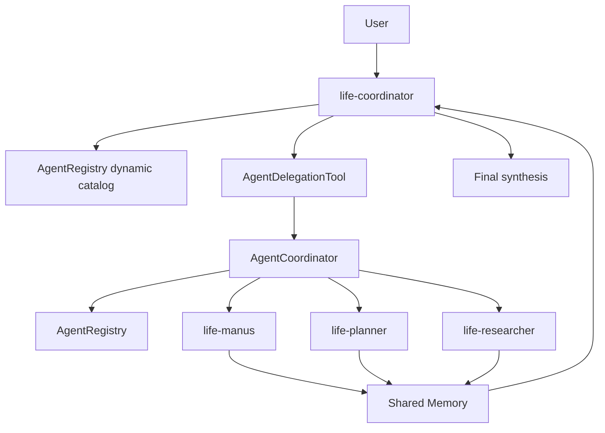

# Multi-Agent、任务委派与共享记忆

本文说明当前项目如何注册多个 Agent、由 Supervisor 选择 Worker、执行 Agent-to-Agent 任务委派，并通过共享记忆传递跨 Agent 上下文。

## 1. 组件关系



主要类：

| 类 | 职责 |
| --- | --- |
| `AgentProfile` | 描述 Agent ID、名称、能力、prompt、步数、标签和角色 |
| `AgentRegistry` | 注册 Agent、生成动态清单、按标签选择 Worker、处理 conversationId |
| `LifeAssistantApp` | 根据 profile 创建运行实例并选择工具集 |
| `AgentDelegationTool` | 把模型的委派 Tool Call 转给协调器 |
| `AgentCoordinator` | 创建 Worker、执行重试、返回结果并更新共享记忆 |
| `LifeMemoryService` | 管理核心记忆、共享记忆和归档记忆 |
| `ChatMemoryCompressAgent` | 压缩过长的任务、结果和共享记忆 block |

## 2. AgentProfile

`AgentProfile` 是 Agent 的静态定义：

```java
public record AgentProfile(
    String id,
    String name,
    String description,
    String systemPrompt,
    String nextStepPrompt,
    int maxSteps,
    List<String> tags,
    boolean supervisor
) {}
```

字段用途：

| 字段 | 用途 |
| --- | --- |
| `id` | 路由、Redis 命名和 API 参数中的稳定标识 |
| `name` | 展示名 |
| `description` | 动态 Agent 清单中的能力说明 |
| `systemPrompt` | 角色边界和长期行为规则 |
| `nextStepPrompt` | 从第二步开始用于继续决策的提示 |
| `maxSteps` | 单次运行的最大循环步数 |
| `tags` | 标签路由能力 |
| `supervisor` | 决定是否获得委派工具和动态 Worker 清单 |

每次请求都会创建一个新的 `LifeManusAgent` 运行实例；长期状态不保存在 Java 对象里，而保存在 Redis 和 PGVector 中。

## 3. 当前 Agent

| Agent ID | maxSteps | 标签摘要 | 职责 |
| --- | ---: | --- | --- |
| `life-coordinator` | 24 | `supervisor, coordinator, life` | 拆解、路由、共享记忆、最终合成 |
| `life-manus` | 20 | `worker, general, life` | 通用生活任务和跨工具执行 |
| `life-planner` | 18 | `planning, schedule, budget, todo, travel` | 计划、日程、清单和预算 |
| `life-researcher` | 18 | `research, web, rag, archive` | 网页、知识检索、资料提炼和归档 |

默认入口：

```java
AgentRegistry.DEFAULT_AGENT_ID = "life-coordinator";
```

`agentId` 为空时会使用默认入口。

## 4. Supervisor 如何发现 Worker

Worker 清单不固定写在 Supervisor 的静态 prompt 中。运行时有两条发现路径：

### 4.1 创建时注入

`LifeAssistantApp.createAgent()` 对 Supervisor 调用：

```java
withDynamicAgentCatalog(profile)
```

该方法把 `AgentRegistry.renderAvailableWorkersForPrompt()` 的当前结果追加到 system prompt。每次创建 Supervisor 实例都会重新生成，因此注册表变更会自动生效。

### 4.2 工具查询

Supervisor 可以调用：

```text
listAvailableAgents()
```

工具直接读取 `AgentRegistry.describeAvailableAgents()`，返回当前注册的 Agent ID、描述、标签和角色。

新增 Worker 时，主要修改点只有 `AgentRegistry`。只要 profile 的描述和标签准确，Supervisor 就能发现并选择它。

## 5. 工具权限边界

`ToolRegistration` 注册两组安全包装后的工具：

| Bean | 使用者 | 委派工具 |
| --- | --- | --- |
| `workerTools` | 所有 Worker | 不包含 |
| `supervisorTools` | Supervisor | 包含 `AgentDelegationTool` |

两组工具都包含文件、网页、计划、待办、预算、Skill、记忆、受限代码执行和终止工具。

Worker 不持有 `AgentDelegationTool`，所以无法继续创建新的 Worker 调用链。这一限制同时降低递归委派、循环路由和不可控资源消耗的风险。

所有工具随后由 `ToolSafetyService.secure(...)` 包装。委派工具也必须经过当前工具权限模式判断。

## 6. Agent-to-Agent 工具

`AgentDelegationTool` 只对 Supervisor 暴露三个工具：

```text
listAvailableAgents()
delegateToAgent(targetAgentId, task, ToolContext)
delegateToAgentsByTags(matchAllTags, matchSomeTags, task, ToolContext)
```

模型只负责提供目标和业务任务，不能提供 conversationId。工具从 Spring AI `ToolContext` 中读取当前 Supervisor conversationId。

### 单 Agent 委派

```text
delegateToAgent(
  targetAgentId = "life-planner",
  task = "根据约束生成两天行程和预算"
)
```

### 标签委派

```text
delegateToAgentsByTags(
  matchAllTags = "worker",
  matchSomeTags = "planning,research",
  task = "分别从计划和资料角度给出建议"
)
```

标签规则：

- `matchAllTags` 中的标签必须全部满足。
- `matchSomeTags` 非空时至少满足一个。
- Supervisor profile 不会作为 Worker 返回。
- 当前实现对匹配到的 Worker 进行同步顺序执行。

## 7. 委派执行流程

```text
Supervisor 产生 delegateToAgent Tool Call
  -> SecureToolCallback 判断是否允许
  -> AgentDelegationTool 从 ToolContext 读取 currentConversationId
  -> AgentCoordinator 校验目标 Worker
  -> 从 currentConversationId 提取 rootChatId
  -> 构造 workerConversationId = workerId:rootChatId
  -> 使用 workerTools 创建 Worker 运行实例
  -> Worker.run(delegatedPrompt, workerConversationId)
  -> 校验结果是否可用
  -> 写入 shared.delegation_results
  -> 将简洁 Worker 结果作为 Tool Result 返回 Supervisor
  -> Supervisor 继续循环并生成最终合成结果
```

Worker prompt 会明确要求只完成被委派的子任务，并返回适合 Supervisor 合成的简洁结果。

## 8. conversationId 隔离

假设 root chatId 是 `abc`：

```text
life-coordinator:abc
life-manus:abc
life-planner:abc
life-researcher:abc
```

每个 Agent 的私有对话状态：

```text
chat:memory:{agentId}:abc
life:memory:queue:summary:{agentId}:abc
life:memory:queue:compressed-count:{agentId}:abc
```

每个 Agent 的跨对话核心记忆：

```text
life:memory:core:{agentId}
```

所有 Agent 共享：

```text
life:memory:shared:abc
```

这样可以避免不同 Agent 的步骤消息互相污染，同时允许它们共享同一任务的关键事实和 Worker 结果。

## 9. 共享记忆

共享记忆在每个 Agent 的 system prompt 中自动渲染，不需要 Worker 先调用工具才能看到。

默认 block：

```text
shared.user_profile
shared.global_preferences
shared.team_context
shared.task_board
shared.delegation_results
```

使用规则：

- 稳定用户事实写入 `user_profile`。
- 本次任务的通用偏好和限制写入 `global_preferences`。
- 所有 Agent 都需要的背景事实写入 `team_context`。
- 子任务状态和未完成项写入 `task_board`。
- Worker 产出由协调器写入 `delegation_results`。

可用工具：

```text
sharedMemoryInsert
sharedMemoryReplace
sharedMemorySearch
```

子 Agent 读取共享记忆有两条路径：

1. 每轮 system prompt 自动包含全部共享 block。
2. 需要从较长 block 中定位内容时调用 `sharedMemorySearch`。

`sharedMemorySearch` 已注册在 Worker 和 Supervisor 工具集中。模型只能调用已注册的 ToolCallback；未注册的工具名不会被 Spring AI 执行。

## 10. 委派结果压缩

`AgentCoordinator` 对共享记忆写入设置了多层限制：

| 项目 | 阈值 | 处理 |
| --- | ---: | --- |
| 单条委派任务 | 500 字符 | 调用 `compressLongText` 提取任务约束 |
| 单条 Worker 结果 | 2000 字符 | 调用 `compressLongText` 提取结论和失败信息 |
| `delegation_results` 合并内容 | 9000 字符 | 调用 `compressSharedMemoryBlock` |
| 压缩目标 | 5000 字符 | 整体替换共享 block |
| Shared block 硬限制 | 12000 字符 | 写入失败后再次压缩并替换 |

压缩需要保留：

- Worker 名称和目标。
- 可复用结论。
- 用户约束和关键事实。
- 失败原因、未解决问题和后续动作。

模型压缩失败时才执行本地长度兜底，保证委派主流程仍能返回。

## 11. 重试与失败处理

单个 Worker 最多执行 2 次：

```java
MAX_DELEGATION_ATTEMPTS = 2;
```

以下响应视为不可用：

- 空响应。
- 以 Agent 执行失败信息开头。
- 以委派失败信息开头。

两次都失败后，协调器返回结构化失败结果，包含 Worker、尝试次数和原因，并把失败摘要写入 `delegation_results`。Supervisor 可以基于现有上下文继续回答，也可以明确告诉用户哪部分未完成。

## 12. 最终输出边界

Worker 返回值是 Supervisor 的内部 Tool Result，不直接作为页面消息展示。Supervisor 的职责是：

- 合并多个 Worker 的有效结论。
- 去除 Worker 调试过程和重复内容。
- 处理结论冲突并标明不确定性。
- 生成一份面向用户的最终自然语言回答。

`ToolTraceSanitizer` 会从用户可见文本中去除工具名、调用 ID、参数和内部返回等轨迹。

## 13. API

查询 Agent：

```text
GET /api/ai/life/agents
```

选择指定 Agent 对话：

```text
GET /api/ai/life/chat/sse
  ?message=...
  &chatId=<root-uuid>
  &agentId=life-planner
```

不传 `agentId` 时使用 `life-coordinator`。

## 14. 新增 Worker

在 `AgentRegistry.buildProfiles()` 中新增 `AgentProfile`：

1. 使用稳定且唯一的 `id`。
2. 将 `supervisor` 设为 `false`。
3. 用简洁 `description` 表明适用任务。
4. 配置准确标签，供 `findWorkerProfiles()` 路由。
5. 设置合理的 `maxSteps`。
6. 在 prompt 中限定职责和最终输出格式。

注册后自动获得：

- `/agents` 接口展示。
- Supervisor 动态清单注入。
- `listAvailableAgents()` 查询结果。
- root chatId 下的独立 conversationId。
- Worker 工具集、核心记忆、共享记忆和上下文压缩。
- 删除 root 对话时的同步清理。

只有新增特殊工具权限时，才需要继续调整 `ToolRegistration` 和 `ToolSafetyService`。

## 15. 推荐阅读顺序

1. `AgentProfile`
2. `AgentRegistry`
3. `LifeAssistantApp`
4. `ToolRegistration`
5. `AgentDelegationTool`
6. `AgentCoordinator`
7. `AgentRunContext`
8. `LifeMemoryService`
9. `ChatMemoryCompressAgent`
10. `BaseAgent`

## 16. 当前边界

- 标签广播是同步顺序执行，耗时会叠加到 Supervisor 请求。
- 没有持久化 delegation job、取消机制或独立任务状态表。
- Worker 不能继续委派，复杂层级任务必须回到 Supervisor 重新拆分。
- 核心记忆是 Agent 级全局状态，尚未按用户隔离。
- 共享记忆按 rootChatId 隔离，不适合作为跨对话的用户画像存储。
- 多个 Agent 同时替换同一个 shared block 时没有版本号或乐观锁，当前依靠单次请求内的顺序执行降低冲突概率。