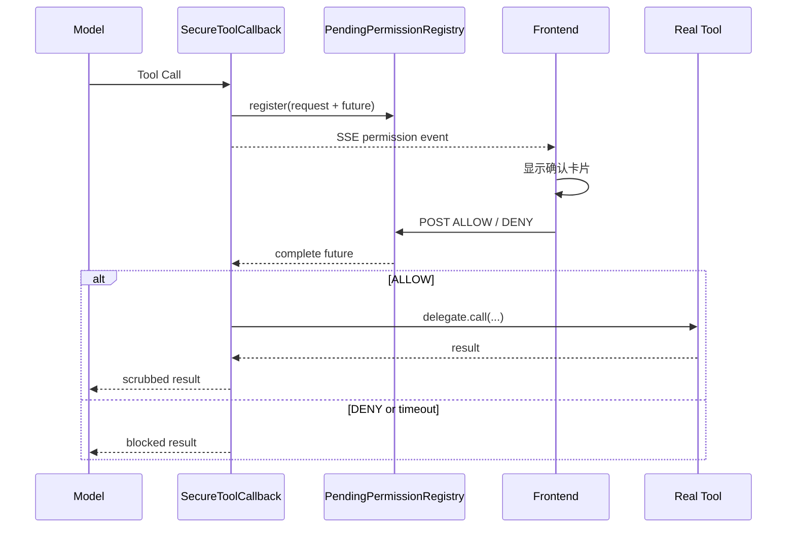

# 工具调用安全机制

本项目把模型的工具选择与真实工具执行分开处理。模型可以提出 Tool Call，但所有已注册工具都必须先经过统一权限判断、用户确认和输出脱敏，之后才可能进入真实方法。

## 1. 安全组件

| 组件 | 职责 |
| --- | --- |
| `SafetyProperties` | 绑定权限模式、沙箱和密钥配置 |
| `ToolSafetyService` | 工具风险分类并返回 `ALLOW / ASK / DENY` |
| `SecureToolCallback` | 包装真实 ToolCallback，执行权限流程和结果脱敏 |
| `PendingPermissionRegistry` | 保存等待用户决策的请求和 `CompletableFuture` |
| `SecretManager` | 密钥名称解析、临时注入和内容脱敏 |
| `ToolTraceSanitizer` | 移除用户可见文本中的内部工具轨迹 |
| `SandboxedCodeTool` | 在受限目录和独立 JShell 进程中执行小段 Java 代码 |
| `LifeFileTool` | 限制文件访问不能越过 workspace |
| `AgentRunContext` | 通过 `ToolContext` 传递 conversationId 和 SSE emitter |

## 2. 工具注册与执行链

`ToolRegistration` 先调用：

```java
ToolCallbacks.from(toolObjects...)
```

Spring AI 会把带 `@Tool` 的 Java 方法转换为实际的 Method ToolCallback。随后项目调用：

```java
toolSafetyService.secure(tools)
```

每一个真实 callback 都被包装为：

```text
SecureToolCallback(delegate = originalToolCallback)
```

Agent 最终拿到的 `workerTools` 和 `supervisorTools` 只包含这些安全包装器，不直接暴露原始 callback。

完整调用链：

```text
模型返回 Tool Call
  -> ToolCallAgent.act()
  -> ToolCallingManager.executeToolCalls(...)
  -> 按工具名从当前 ToolCallback[] 查找 callback
  -> SecureToolCallback.call(toolInput, toolContext)
  -> ToolSafetyService.decide(toolName)
  -> DENY: 返回拒绝结果
  -> ASK: 等待前端 ALLOW / DENY
  -> ALLOW: delegate.call(toolInput, toolContext)
  -> 原始 Java @Tool 方法
  -> SecretManager.scrub(result)
  -> ToolExecutionResult.conversationHistory
```

`delegate` 在构造 `SecureToolCallback` 时传入，并声明为 `final ToolCallback`。它就是当前包装器对应的原始 callback。`ToolCallingManager` 无法绕过包装器直接取得原始 callback，因为注册给 Agent 的数组已经替换为包装器数组。

## 3. 工具风险分类

`ToolSafetyService.classify()` 使用工具名分类：

| 分类 | 当前工具 |
| --- | --- |
| `FILE_EDIT` | `writeLifeNote`、`appendLifeNote` |
| `MEMORY_WRITE` | 核心、共享、归档记忆写入和替换工具 |
| `DELEGATION` | `delegateToAgent`、`delegateToAgentsByTags` |
| `READ_ONLY` | 文件读取、网页抓取、Skill 查询、记忆搜索、Agent 列表 |
| `COMPUTE_ONLY` | 日程、菜单、出行清单、待办、预算计算 |
| `CODE_EXECUTION` | `runCode` |
| `TERMINATE` | `doTerminate` |
| `UNKNOWN` | 未列入分类表的工具 |

新增工具后必须同步评估并加入分类集合。未分类工具会进入 `UNKNOWN`，在大多数模式下采取保守策略。

## 4. 权限模式

配置：

```yaml
life-assistant:
  safety:
    tool-permission-mode: default
```

| 模式 | 只读/计算 | 文件编辑 | 记忆写入 | 委派 | 代码 | 未知 | 终止 |
| --- | --- | --- | --- | --- | --- | --- | --- |
| `DEFAULT` | 询问 | 询问 | 询问 | 询问 | 询问 | 询问 | 允许 |
| `ACCEPT_EDITS` | 允许 | 允许 | 询问 | 询问 | 询问 | 询问 | 允许 |
| `PLAN` | 允许 | 拒绝 | 拒绝 | 拒绝 | 拒绝 | 拒绝 | 允许 |
| `BYPASS` | 允许 | 允许 | 允许 | 允许 | 允许 | 允许 | 允许 |
| `YOLO` | 允许 | 允许 | 允许 | 允许 | 允许 | 允许 | 允许 |

`BYPASS` 和 `YOLO` 只跳过统一确认，文件路径、沙箱 token、语言白名单、超时和密钥脱敏仍然生效。

## 5. 前端模式选择器

前端输入框下方提供以下选项：

```text
请求批准       -> DEFAULT
接受编辑       -> ACCEPT_EDITS
计划模式       -> PLAN
自动允许       -> BYPASS
YOLO           -> YOLO
```

页面加载时先读取：

```text
GET /api/ai/life/health
```

并使用返回的 `toolPermissionMode` 校准本地显示。用户切换时调用：

```text
POST /api/ai/life/tool-permission-mode?mode=ACCEPT_EDITS
```

后端更新当前 `SafetyProperties` 并返回实际模式。

注意：运行时模式是应用进程级共享状态，不按用户或 chatId 隔离，也不会回写 `application.yml`。应用重启后重新读取配置文件。如果用于多用户环境，应将模式改成用户或会话级状态，并增加身份认证和授权。

## 6. ASK 确认流程

当决策为 `ASK`：



请求字段：

```text
requestId
chatId
toolName
riskCategory
mode
reason
```

主路径由 `SecureToolCallback.pushPermissionEvent()` 发送 SSE 自定义事件 `permission`。前端同时每秒轮询：

```text
GET /api/ai/life/pending-permission?chatId={rootChatId}
```

轮询用于代理或浏览器未及时分发自定义 SSE 事件时兜底。用户点击后调用：

```text
POST /api/ai/life/tool-permission
  ?chatId={request.chatId}
  &requestId={requestId}
  &action=ALLOW|DENY
```

确认卡片提交后立即从页面移除。后端 `CompletableFuture` 最长等待 120 秒；超时、连接结束或 cleanup 都会拒绝并清理未完成请求。

## 7. ToolContext 安全边界

`ToolCallAgent.bindToolContext()` 在模型调用和工具执行前写入当前 conversationId：

```java
toolCallingChatOptions.setToolContext(
    AgentRunContext.toolContext(activeChatId)
);
```

记忆和委派工具从 `ToolContext` 读取 chatId，而不是让模型生成：

```java
AgentRunContext.getChatId(toolContext)
```

这样可以防止模型把数据写到任意会话，也修复异步执行时普通线程变量为空的问题。线程内变量只用于兼容路径和 SSE 事件访问。

## 8. 受限代码执行

`runCode` 当前只支持 Java/JShell，用于小型计算和无副作用的数据转换。

目录结构：

```text
{workspace}/sandbox/{safeChatId}/{runUuid}/
  snippet.jsh
  stdout.txt
  stderr.txt
```

执行过程：

1. 检查语言是否在 `allowed-languages`。
2. 检查代码是否包含禁止 token。
3. 创建单次运行目录。
4. 仅在执行前解析允许的 `$SECRET_NAME` 占位符。
5. 启动独立 `jshell --execution local` 进程。
6. 清空环境变量，只保留 Java 和临时目录所需最小集合。
7. 应用超时，超时后强制终止进程。
8. 限制 stdout/stderr 最大长度。
9. 返回前再次脱敏。

默认配置：

```yaml
life-assistant:
  safety:
    sandbox:
      timeout-seconds: 5
      max-output-chars: 8000
      allowed-languages:
        - java
```

禁止项覆盖文件 I/O、网络、进程创建、环境变量读取、系统属性、反射、脚本引擎和明显无限循环等入口。

这属于本地最佳努力隔离，不是容器、虚拟机或远程沙箱。处理不可信代码时应替换为操作系统级低权限账户、容器或独立执行服务，并设置 CPU、内存、网络和文件系统限制。

## 9. 文件安全

`LifeFileTool` 将 workspace 转换为绝对规范路径。所有相对文件名都经过：

```java
workspace.resolve(fileName).normalize()
```

随后检查目标路径必须以 workspace 开头。`../` 等越界路径会抛出异常。

写入和追加前会调用 `SecretManager.scrub(...)`，避免真实密钥长期进入文件。

## 10. 密钥安全

配置示例：

```yaml
life-assistant:
  safety:
    secrets:
      allowed-names:
        - OPENAI_API_KEY
        - DASHSCOPE_API_KEY
        - PGSQL_PASSWORD
      aliases:
        DASHSCOPE_API_KEY: ai.my-api-key
        PGSQL_PASSWORD: pgsql.password
```

原则：

- system prompt 只列出允许引用的密钥名称。
- 模型可以生成 `$DASHSCOPE_API_KEY`，不能看到配置中的真实值。
- 只有受限代码工具可以在执行前解析白名单占位符。
- 工具返回、日志、Redis、PGVector 和文件写入前都要脱敏。
- 已知真实值会替换回 `$SECRET_NAME`。
- Bearer Token、常见 API Key 表达式和常见 Key 格式会替换为 redacted marker。

`SecretManager` 无法识别所有自定义凭据格式。新增密钥来源时应同时更新白名单、alias 和脱敏规则。

## 11. 内部工具轨迹

为了后端调试和 Redis cleanup，工具调用与工具结果会先作为内部 Assistant 消息保存。用户可见输出由以下边界控制：

- `ToolCallAgent` 最终只返回自然语言结果。
- 每一步执行结果只写后端日志。
- `ToolTraceSanitizer` 删除工具名、调用 ID、参数和返回前缀。
- `RedisChatMemoryRepository.findByConversationId()` 默认过滤内部工具轨迹。
- `findRawByConversationId()` 只用于内部保存和清理逻辑。
- `BaseAgent.cleanup()` 可删除本轮中间工具消息。

这保证了“内部可调试”和“前端不泄露工具细节”可以同时成立。

## 12. 安全相关 API

| 方法 | 路径 | 作用 |
| --- | --- | --- |
| `GET` | `/api/ai/life/health` | 查询当前权限模式 |
| `POST` | `/api/ai/life/tool-permission-mode` | 切换运行时模式 |
| `GET` | `/api/ai/life/pending-permission` | 查询待确认请求 |
| `POST` | `/api/ai/life/tool-permission` | 提交允许或拒绝 |

模式参数兼容：

```text
DEFAULT
ACCEPT_EDITS
accept-edits
acceptEdits
PLAN
BYPASS
YOLO
```

## 13. 新增工具检查清单

新增 `@Tool` 后至少检查：

1. 是否注册到正确工具集。
2. 是否应仅 Supervisor 使用。
3. 是否已加入 `ToolSafetyService` 的风险分类。
4. 是否使用 `ToolContext` 取得可信 conversationId。
5. 是否限制文件路径、网络目标、数据库范围或外部 API 参数。
6. 是否需要用户确认。
7. 是否会把 secret 写入日志、文件、Redis 或 PGVector。
8. 是否有超时、重试和输出长度限制。
9. 错误结果是否会误导模型认为工具已成功。
10. 最终用户回答是否移除了内部工具轨迹。

## 14. 当前边界

- 权限注册表保存在当前 JVM 内，应用重启会丢失待确认请求。
- 运行时权限模式是全局状态，尚未做用户隔离。
- 权限接口没有独立认证层，生产环境必须增加身份校验和 CSRF/CORS 策略。
- `BYPASS` 和 `YOLO` 风险最高，不适合作为公开服务默认值。
- 本地 JShell 不能提供强隔离保证。
- 工具风险分类依赖工具名；新增工具未分类时只能依靠 `UNKNOWN` 兜底。