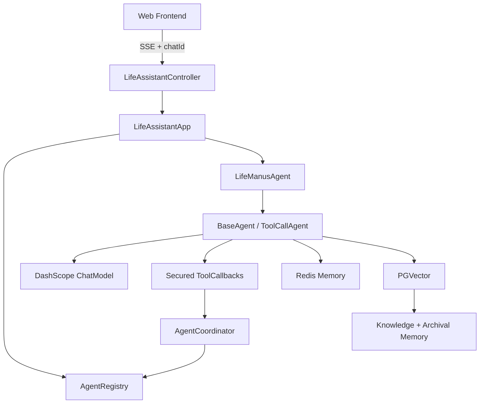

# Life Assistant Agent

`life-assistant-agent` 是一个基于 Java 21、Spring Boot、Spring AI 和 DashScope 的生活助手后端。项目提供多 Agent 协作、工具调用、流式对话、分层记忆、RAG、Skill、工具权限确认、密钥脱敏和受限代码执行，并附带由 Nginx 托管的静态聊天前端。

## 当前能力

- 使用 `life-coordinator` 作为默认入口，按任务内容直接回答或委派给专用 Worker。
- 使用 Spring AI Tool Calling 执行文件、网页、计划、待办、预算、记忆、Skill 和代码工具。
- 通过 SSE 只向用户流式输出最终自然语言结果，步骤结果保留在后端日志和内部消息中。
- 使用 Redis 保存完整对话、上下文压缩状态、Agent 核心记忆和会话共享记忆。
- 使用 PostgreSQL + PGVector 保存内置生活知识和长期归档记忆。
- 在前端显示工具权限确认卡片，并支持运行时切换工具权限模式。
- 支持删除对话，同时清理对应 Redis 对话、共享记忆、压缩状态和 PGVector 归档记录。
- 每累计 20 条 Supervisor 用户消息，异步整理一次长期核心记忆，不阻塞当前响应。

## 技术栈

| 模块 | 实现 |
| --- | --- |
| 运行时 | Java 21、Spring Boot 3.5.11 |
| Agent 编排 | Spring AI 1.1.2、Spring AI Alibaba 1.1.2.0 |
| 模型 | DashScope `qwen-max` |
| 对话与状态 | Redis |
| 关系与向量存储 | PostgreSQL、PGVector |
| 文档解析 | Spring AI Markdown Document Reader |
| 网页解析 | Jsoup |
| API 文档 | Knife4j、Springdoc OpenAPI |
| 前端 | HTML、CSS、JavaScript、Nginx |

## 系统结构



一次流式请求的主链路：

```text
GET /api/ai/life/chat/sse
  -> LifeAssistantController
  -> LifeAssistantApp 根据 agentId 取得 AgentProfile
  -> root chatId 转换为 agentId:rootChatId
  -> LifeManusAgent.runStream(...)
  -> ToolCallAgent.think()
  -> 模型直接回答或选择工具
  -> ToolCallingManager.executeToolCalls(...)
  -> SecureToolCallback 权限判断
  -> 真实 ToolCallback 执行
  -> Agent 循环继续
  -> 最终自然语言按小块发送给前端
  -> cleanup 清理中间工具消息并更新压缩状态
```

## Agent 体系

`AgentRegistry` 当前注册 4 个 Agent：

| Agent ID | 角色 | 主要职责 |
| --- | --- | --- |
| `life-coordinator` | Supervisor | 拆分任务、选择 Worker、维护共享记忆、汇总最终结果 |
| `life-manus` | Worker | 通用生活任务、跨工具执行 |
| `life-planner` | Worker | 日程、待办、出行、预算和清单 |
| `life-researcher` | Worker | 网页资料、知识检索、信息提炼和归档 |

Supervisor 的 Worker 清单由 `AgentRegistry` 在创建运行实例时动态加入 system prompt，也可以通过 `listAvailableAgents` 工具重新查询。新增 Worker 后无需同步维护一份固定清单。

Supervisor 使用 `supervisorTools`，Worker 使用 `workerTools`。两组工具的主要差异是 Worker 不包含 `AgentDelegationTool`，因此不会递归委派。

详细机制见 [README-MULTI-AGENT.md](README-MULTI-AGENT.md)。

## Agent 执行循环

| 类 | 职责 |
| --- | --- |
| `BaseAgent` | 生命周期、循环步数、SSE、最终消息保存、清理和上下文压缩 |
| `ReActAgent` | 定义 `think()` 与 `act()` 两阶段流程 |
| `ToolCallAgent` | 调用模型、识别 Tool Call、执行工具并维护当前消息列表 |
| `LifeManusAgent` | 根据 `AgentProfile` 装配模型、Advisor、工具和记忆 |
| `AgentRunContext` | 将 conversationId、SSE emitter 放入 `ToolContext`，并保留线程内兜底上下文 |

第一步只使用原始 `UserPrompt`；从第二步开始才追加 `nextStepPrompt`。工具步骤只写日志和内部消息，用户最终看到的是整理后的自然语言回答。

## 工具

当前注册的主要工具：

| 工具类 | 能力 |
| --- | --- |
| `LifeFileTool` | 在工作目录内读取、写入和追加 UTF-8 文件 |
| `WebScrapingTool` | 抓取网页正文 |
| `LifePlannerTool` | 日程、饮食、穿搭和出行清单 |
| `TodoArchiveTool` | 待办整理和归档 |
| `BudgetTool` | 预算汇总 |
| `SkillTool` | Skill 列表、检索和按需加载 |
| `LifeMemoryTool` | 核心、共享、归档和对话记忆 |
| `SandboxedCodeTool` | 受限 Java/JShell 计算 |
| `AgentDelegationTool` | Supervisor 专用的 Worker 查询和任务委派 |
| `TerminateTool` | 结束当前 Agent 循环 |

所有工具在注册后都会被 `SecureToolCallback` 包装，模型拿到的是安全包装后的 `ToolCallback[]`。

## Skill

Skill 资源位于：

```text
src/main/resources/skills/{skillId}/SKILL.md
```

当前内置 Skill：

| Skill ID | 内容 |
| --- | --- |
| `memory-engineering` | 记忆写入、去重、压缩和冲突处理 |
| `multi-agent-delegation` | 任务拆分、Worker 选择和结果合成 |
| `agent-to-agent-protocol` | 任务消息、状态、重试、升级和交接 |
| `tool-use-safety` | 工具权限、写操作、沙箱和密钥规则 |
| `agent-evaluation` | 约束检查、记忆检查、事实风险和结果复核 |

`AgentSkillRepository` 启动时动态扫描所有 `SKILL.md`。核心记忆中的 `skills` block 只保存名称和简短描述，完整内容由 `readSkill(skillId)` 按需加载，避免每轮注入全部规则。

## 记忆与上下文

| 层级 | 存储 | 作用域 | 用途 |
| --- | --- | --- | --- |
| 对话记忆 | Redis List | `agentId:rootChatId` | 用户消息、工具过程和 Assistant 消息 |
| 队列摘要 | Redis String | `agentId:rootChatId` | 压缩较早的对话，控制活跃上下文大小 |
| 核心记忆 | Redis Hash | `agentId` | Agent 跨对话复用的长期状态 |
| 共享记忆 | Redis Hash | `rootChatId` | 同一对话内 Supervisor 与 Worker 的公共上下文 |
| 归档记忆 | PGVector | conversationId | 可按语义检索的长期材料 |
| RAG 知识库 | PGVector | 全局文档 | `resources/document` 中的生活知识 |

核心记忆默认包含 `persona`、`human`、`preferences`、`working`、`skills`。`skills` 由系统维护，记忆工具不能覆盖。

详细流程、Redis Key 和清理规则见 [README-MEMORY.md](README-MEMORY.md)。

## RAG 与 PGVector

项目手动构造两个 `PgVectorStore`：

| 表 | 内容 |
| --- | --- |
| `public.vector_store` | 内置 Markdown 生活知识 |
| `public.life_archival_memory` | Agent 写入的长期归档记忆 |

两者都使用 1024 维向量、余弦距离和 HNSW 索引。配置位于 Java 代码中，不依赖 `spring.ai.vectorstore.pgvector` 自动装配项。

`PgVectorStoreConfig` 会加载 `src/main/resources/document/*.md`，通过稳定 ID 和内容哈希判断新增、修改和删除，并按配置决定是否自动同步。

## 安全机制

工具权限模式：

| 模式 | 行为 |
| --- | --- |
| `DEFAULT` | 除终止工具外，每次调用都要求用户确认 |
| `ACCEPT_EDITS` | 只读、计算和文件编辑自动允许；记忆写入、委派、代码和未知工具仍确认 |
| `PLAN` | 只读和计算工具允许；有副作用的工具直接拒绝 |
| `BYPASS` | 大部分工具自动允许，工具自身限制仍生效 |
| `YOLO` | 与 `BYPASS` 相同的高风险自动执行模式 |

前端输入框下方可切换模式。切换调用后端运行时接口，仅修改当前进程内的 `SafetyProperties`；应用重启后重新读取 `application.yml`。

安全模块还包括：

- 权限请求通过 SSE `permission` 事件推送，前端轮询作为兜底。
- 权限请求等待 120 秒，未处理则自动拒绝。
- 文件工具限制路径必须位于配置的 workspace 内。
- `runCode` 仅支持受限 Java/JShell，使用独立目录、最小环境、超时和输出长度限制。
- 密钥只以名称进入 prompt 和持久化数据，执行前按白名单临时注入，输出和日志再次脱敏。
- 内部工具调用 ID、参数和返回信息不会进入最终用户回答。

详细说明见 [README-SAFETY.md](README-SAFETY.md)。

## 主要配置

```yaml
server:
  port: 8124
  servlet:
    context-path: /api

spring:
  ai:
    dashscope:
      chat:
        options:
          model: qwen-max

life-assistant:
  workspace: D:/codex/life-assistant-agent/tmp
  memory:
    queue:
      max-active-messages: 30
      keep-recent-messages: 16
      compress-batch-messages: 10
      max-active-chars: 18000
    sleeptime:
      trigger-user-messages: 20
      recent-message-limit: 40
      lock-minutes: 10
  safety:
    tool-permission-mode: default
    sandbox:
      timeout-seconds: 5
      max-output-chars: 8000
      allowed-languages: [java]
  vectorstore:
    auto-init: true
    force-reinit: false
```

敏感配置放在 `application-local.yml` 或环境变量中，不应提交真实值。

## HTTP API

后端基础地址：`http://localhost:8124/api`

| 方法 | 路径 | 作用 |
| --- | --- | --- |
| `GET` | `/ai/life/health` | 健康状态、默认 Agent、模型提供方和当前权限模式 |
| `GET` | `/ai/life/agents` | 查询已注册 Agent |
| `GET` | `/ai/life/chat` | 非流式对话 |
| `GET` | `/ai/life/chat/sse` | SSE 流式对话 |
| `GET` | `/ai/life/pending-permission` | 查询待处理工具权限请求 |
| `POST` | `/ai/life/tool-permission` | 提交 `ALLOW` 或 `DENY` |
| `POST` | `/ai/life/tool-permission-mode` | 运行时切换权限模式 |
| `DELETE` | `/ai/life/conversations/{chatId}` | 删除一次 root 对话的持久化记录 |

流式请求示例：

```text
GET /api/ai/life/chat/sse?message=帮我规划周末&chatId=<uuid>&agentId=life-coordinator
```

模式切换示例：

```text
POST /api/ai/life/tool-permission-mode?mode=ACCEPT_EDITS
```

`chatId` 是前端生成的 UUID。同一对话必须复用同一个 root `chatId`，后端会为每个 Agent 派生独立 conversationId。

## 前端与 Nginx

前端位于 `frontend/`，默认通过同源 `/api` 调用后端。Nginx 默认监听：

```text
http://localhost:8080
```

前端提供：

- 本地多对话列表和 UUID `chatId`。
- SSE 最终回答展示与自动滚动。
- 工具权限确认卡片，确认后立即移除。
- `DEFAULT`、`ACCEPT_EDITS`、`PLAN`、`BYPASS`、`YOLO` 模式选择器。
- 删除对话并同步调用后端清理 Redis 和 PGVector。
- API Base URL 设置和明暗主题。

Nginx 使用 `proxy_buffering off` 和 `X-Accel-Buffering: no`，避免代理缓存 SSE。

## 目录

```text
life-assistant-agent/
├─ src/main/java/com/yupi/lifeassistant/
│  ├─ agent/          Agent 循环、注册表、协调器和后台记忆整理
│  ├─ app/            应用编排入口
│  ├─ chatmemory/     Redis 对话消息仓库
│  ├─ controller/     HTTP/SSE 接口
│  ├─ memory/         上下文队列与分层记忆
│  ├─ rag/            文档加载、版本同步和 PGVector
│  ├─ safety/         权限、密钥和工具安全包装
│  ├─ skill/          Skill 仓库与模型
│  └─ tools/          工具实现与注册
├─ src/main/resources/
│  ├─ document/       内置生活知识 Markdown
│  └─ skills/         Skill 定义
├─ frontend/          静态前端与 Nginx
├─ README-MEMORY.md
├─ README-MULTI-AGENT.md
└─ README-SAFETY.md
```

## 推荐阅读顺序

1. `LifeAssistantController`
2. `LifeAssistantApp`
3. `AgentRegistry`
4. `LifeManusAgent`
5. `BaseAgent`
6. `ToolCallAgent`
7. `ToolRegistration`
8. `SecureToolCallback`
9. `AgentCoordinator`
10. `LifeMemoryService`
11. `ContextQueueManager`
12. `ChatMemoryCompressAgent`

## 当前边界

- 权限模式是应用进程级状态，不是按用户或按会话隔离。
- 核心记忆按 Agent ID 隔离，当前没有 userId 维度；多用户部署前应改为 `userId:agentId`。
- 标签委派当前同步顺序执行，不是后台任务队列。
- `runCode` 是本地受限进程，不等同于容器或虚拟机级强隔离。
- 前端对话正文保存在浏览器本地，后端状态保存在 Redis 和 PostgreSQL。